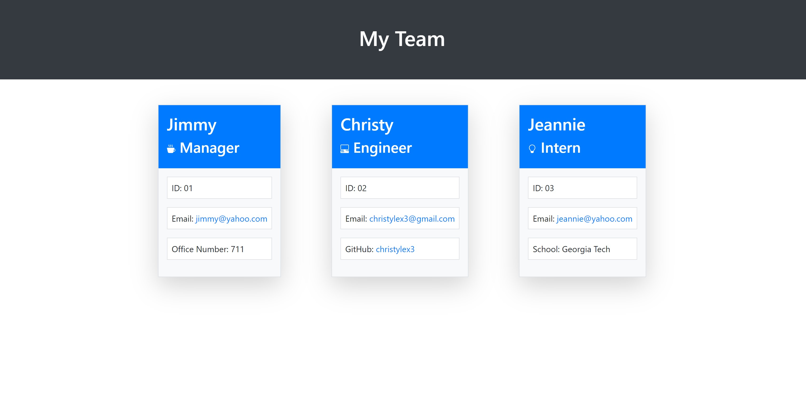

# Team Profile Generator

## Description

This application generates the team's profile based on user's input about the employee's role, their ID, their email, and then depending on their role in the team, their GitHub or the school they've attended.

## Table of Contents

* [Installation](#installation)
* [Usage](#usage)
* [Contribution](#contribution)
* [Tests](#tests)
* [Questions](#questions)

## Installation

The application does require dependencies, so enter this code (below) into the terminal and run it:
```
npm i
```

## Usage

Run `node index.js` and answer the questions. Then navigate to the `src` folder and launch the `teamProfile.html`.

## Credits
* Manager's icon: https://icons.getbootstrap.com/icons/cup-hot-fill/
* Engineer's icon: https://icons.getbootstrap.com/icons/pc-display-horizontal/
* Intern's icon: https://icons.getbootstrap.com/icons/lightbulb/

## Contribution

No contributions needed.

## Tests

Run the following code below to test the application:
```
npm test
```

## Visuals

Here is how the team profile appears when it is generated:


## Questions

If you have any questions and want to reach me, email me at <christylex3@gmail.com>. Also, you can check out my repository [here](https://github.com/christylex3).